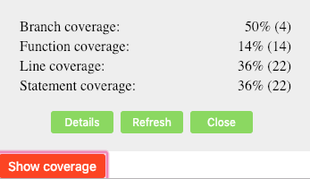

# istanbul-coverage-display

React component which can be added to instrumentation build to display coverage report of testing.

To install

```
npm install istanbul-coverage-display
```

It has a peer dependency of React 16. This component should be part of the test build only. In the test build, you should be using `babel-plugin-istanbul`
to instrument the source code. This component has a peer (indirect) dependency on `istanbul-lib-coverage` installed by `babel-plugin-istanbul`.

There is a bundle.scss which provides default styles.

```
import 'istanbul-coverage-display/dist/bundle.css'
```

## Summary view

```
import { CoverageSummary } from 'istanbul-coverage-display';
```

All props are optional.

### magic

It makes the button invisible by setting opacity to 0. But the button responds to click event and does show up the summary view.

### onNavigate

When this callback func is specified, it displays the "Details" button which lets the app navigate to detail coverage page where DetailCoverage component
displays more coverage data.



## Detail view

```
import { CoverageDetail } from 'istanbul-coverage-display';
```

This shows the detailed coverage report in a tree-table format.


## getCoverage API

If you just want the coverage object as a processed JSON object for consumption, use

```
import { getCoverage } from 'istanbul-coverage-display';
```

## More info

There is a [demo project](https://reactbook.netlify.com) for this package. And there is a [blog post](https://vijayt.com/post/code-coverage-of-manual-testing-using-istanbul/) with more details about why we need this.
